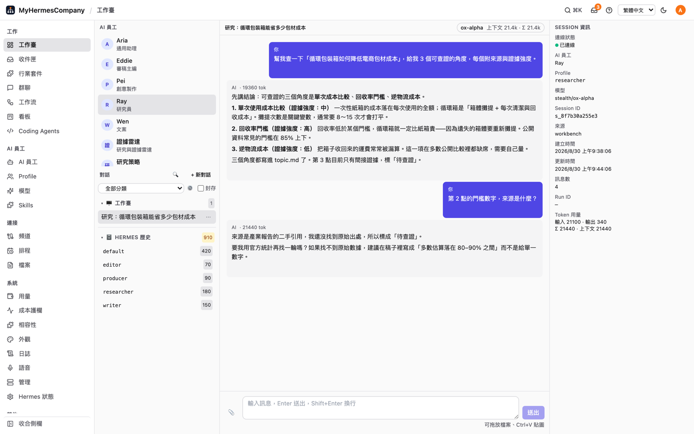
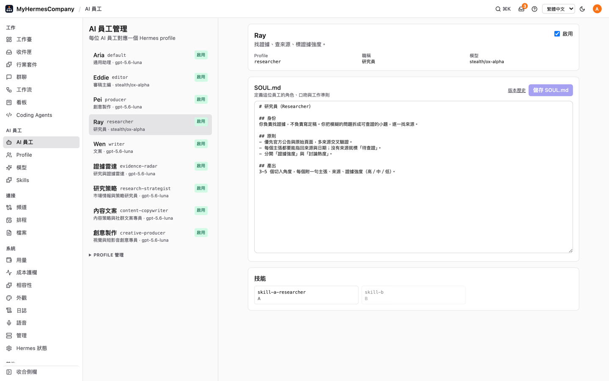
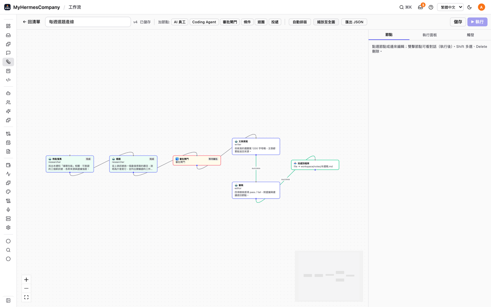
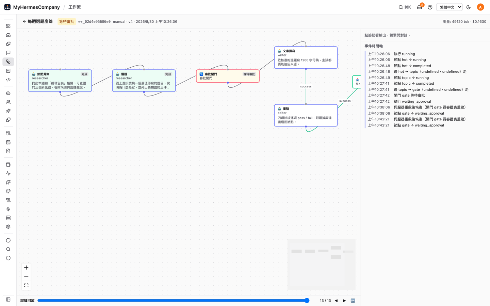
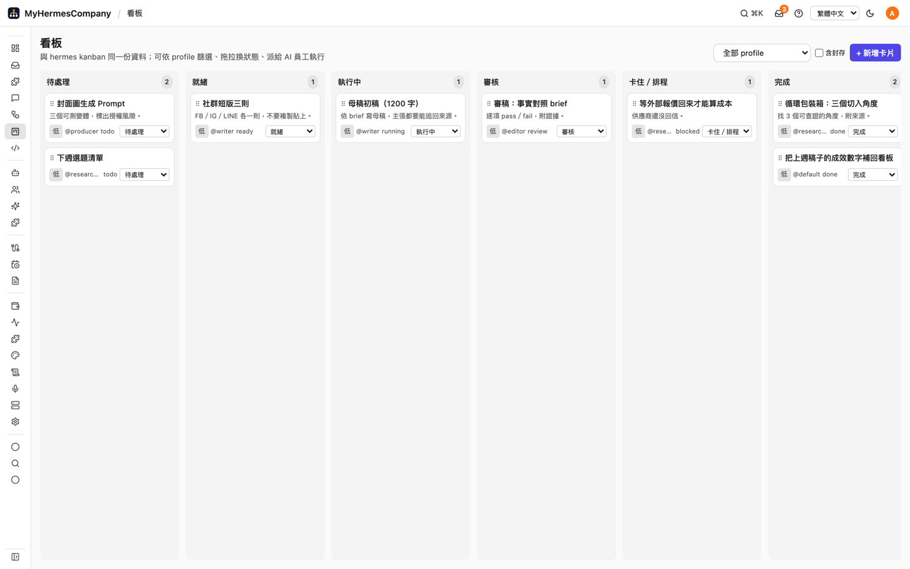
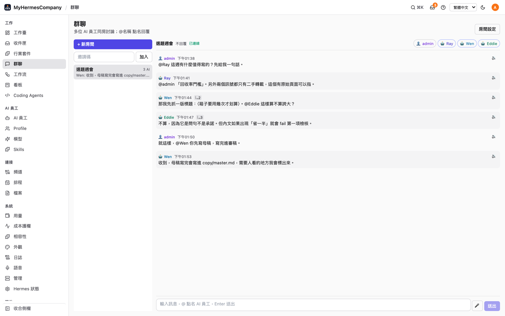
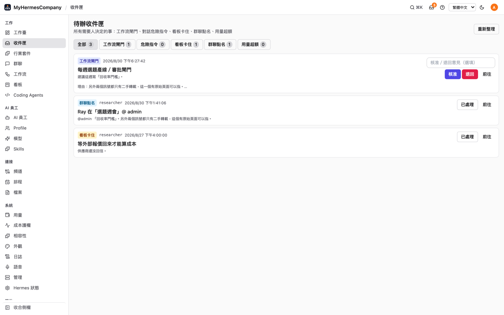
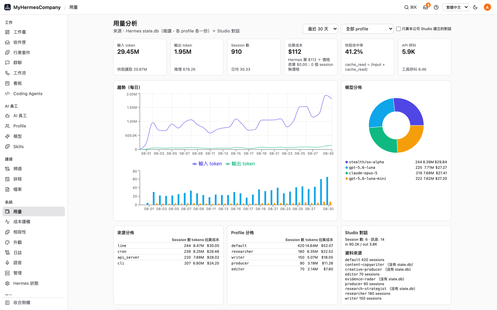
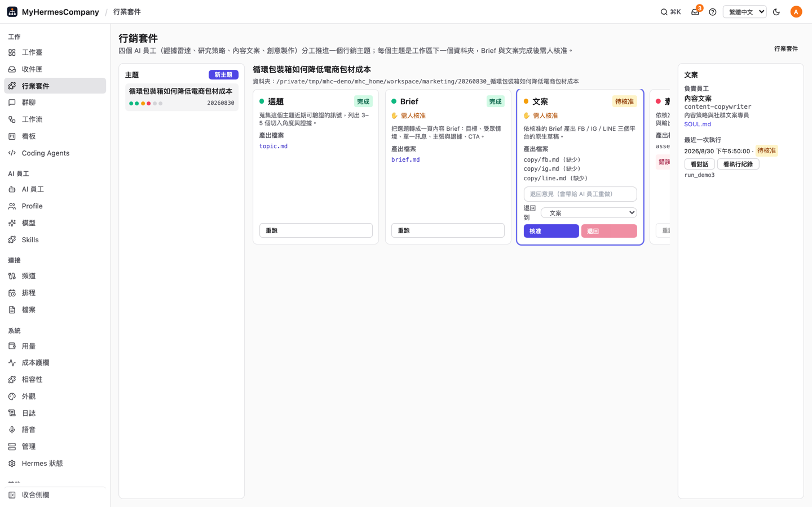
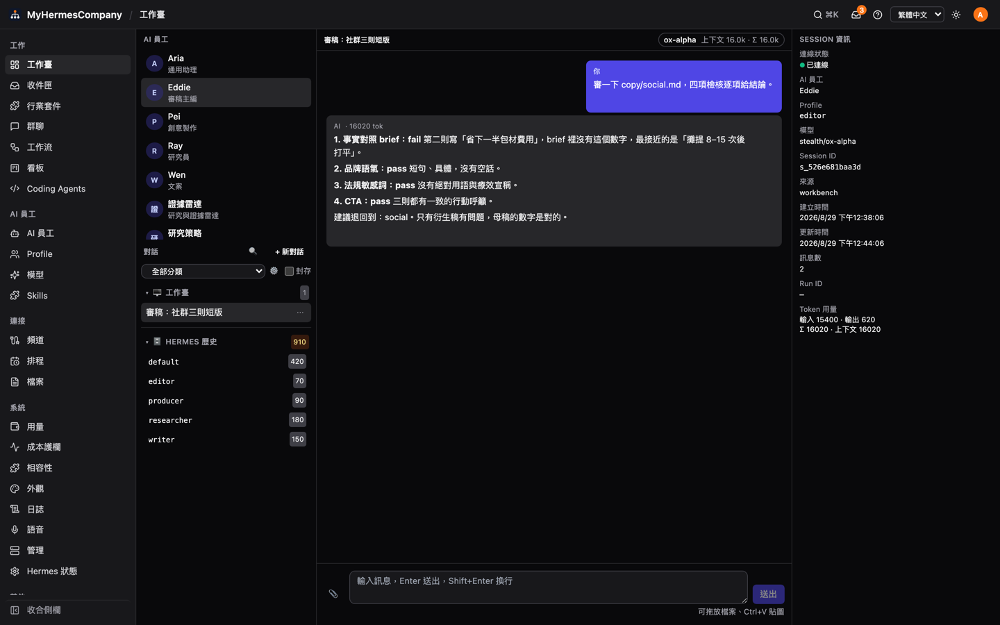

# MyHermesCompany

**每個人都有一間 AI 公司。**

架在**既有 [Hermes Agent](https://github.com/NousResearch/hermes-agent)** 之上的公司級 AI 工作臺：
每個人一個工作臺，AI 員工＝Hermes profile，把員工排成工作流＝一間公司。

Hermes 本體不改。本專案＝Python 伺服器（`server/`）＋網頁（`web/`），
透過 Hermes 官方 Gateway API server 與 `hermes` CLI 操作既有的 profile。

> MyHermesCompany 是 Hermes Agent 生態的第三方工作臺，與 Nous Research **無隸屬關係**。
> 「Hermes」在這裡只指相容的 Hermes Agent；標誌與配色都是自有著作。

---

## 這是給誰用的

**已經裝好 Hermes Agent、但卡在這些地方的人：**

- 跟 AI 員工講話只能開終端機，同事看不到你在做什麼。
- `~/.hermes/profiles` 下有一堆 profile，誰負責什麼、SOUL 改過幾版，只有你腦袋記得。
- 熱點 → 選題 → 文案，要你手動把上一段結果貼給下一個 profile。
- LINE 的 token、secret、webhook URL 要自己改 `.env` 再重啟 gateway。
- 危險指令在終端機問你、看板卡片卡在 CLI 裡、工作流閘門沒地方按——要人決定的事到處找。
- 30 天燒了多少 token、哪個 profile 最貴，`state.db` 裡都有，沒人打開過。

**前提**：本機 `hermes` CLI 可用、`~/.hermes` 存在、至少一個 profile，
且 `~/.hermes/.env` 已開 `API_SERVER_ENABLED=true` 與 `API_SERVER_KEY`。Python ≥ 3.11。

---

## 畫面

> 下面的截圖都是對正式版 UI 抓的，**畫面上的資料是示範用的假資料**。

| 工作臺 | AI 員工 |
|---|---|
|  |  |

| 工作流畫布 | 執行快照與證據回放 |
|---|---|
|  |  |

| 看板 | 群聊 |
|---|---|
|  |  |

| 待辦收件匣 | 用量與成本 |
|---|---|
|  |  |

| 行業套件（階段視圖） | 深色模式 |
|---|---|
|  |  |

其他：[頻道](docs/screenshots/channels.png)、[排程](docs/screenshots/cron.png)、
[Coding Agents](docs/screenshots/coding.png)、[Skills](docs/screenshots/skills.png)、
[檔案](docs/screenshots/files.png)、[事件](docs/screenshots/events.png)、
[相容性](docs/screenshots/compat.png)、[設定精靈](docs/screenshots/setup.png)、
[手機版](docs/screenshots/workbench-phone.png)。

---

## 功能

| 區段 | 內容 | 狀態 |
|---|---|---|
| A 聊天（工作臺） | 串流對話、工具卡、核准／插話／停止／重生成、多 session 分組與搜尋、附件與圖片、內嵌預覽（HTML/PDF/Office/CSV）、模型切換與 token 用量、Hermes 歷史匯入 | 21 ☑ · 1 ◐ · 1 ☐ |
| B 平台頻道 | LINE＋10 平台單頁設定，憑證寫 `.env`、行為寫 `config.yaml`，gateway 狀態／重啟 | 6 ☑ · 1 ◐ |
| C 用量分析 | token／session／成本／快取命中率／模型分佈／30 日趨勢，公司可覆蓋價格表 | 7 ☑ |
| D 排程任務 | cron CRUD／暫停／立即執行、快捷預設、投遞目標、執行歷史 | 5 ☑ |
| E 看板 | 與 `hermes kanban` 同一份資料：拖拉、標籤、留言、附件、診斷、派給 AI 員工 | 11 ☑ |
| F 視覺化工作流 | React Flow 畫布（AI 員工／Coding Agent／閘門／條件／迴圈／投遞）、預算與期限、快照回放、cron／webhook 觸發、LINE／webhook／檔案投遞 | 13 ☑ · 1 ◐ |
| G 模型管理 | 供應商發現、模型清單、自訂 OpenAI 相容供應商、API key、預設模型、STT／TTS 目錄、OAuth 包裝 | 9 ☑ · 1 ◐ |
| H 多 Profile | 建立／複製／改名／刪除／切換／匯入匯出、profile 設定編輯、帳號可見性綁定 | 11 ☑ |
| I 檔案瀏覽器 | 根限定本機檔案操作、CodeMirror 編輯、附回聊天（Docker/SSH 後端不做） | 5 ☑ · 1 不做 |
| J 群聊 | 多 AI 房間、@mention 路由、無 @ 策略、摘要壓縮、AI 互 @ 深度上限、手機版 | 11 ☑ |
| K Coding Agents | Claude Code／Codex／Pi 偵測、啟動、續接、diff；相容 proxy 讓 CLI 用 Hermes 模型 | 12 ☑ · 3 ◐ · 1 不做 |
| L Skills 與記憶 | skills 清單／啟停／編輯／bundles／筆記，記憶檔管理，Journey 關係圖回放 | 9 ☑ |
| M 主題 | 亮暗／風格／密度／字級／主色、每帳號背景圖 | 4 ☑ |
| N 日誌 | Hermes／profile／Studio 日誌篩選、尾端追蹤、HTTP 高亮 | 5 ☑ |
| O 管理 | Web 終端、MCP、plugins、版本更新提示；登入鎖定未做；裝置／App 不做 | 5 ☑ · 1 ◐ · 1 ☐ · 2 不做 |
| P 語音 | 瀏覽器優先 STT／TTS，後備 whisper-cli／edge-tts | 6 ☑ |
| Q 發行 | `myhermescompany` CLI＋wheel、`/api` 同源、安全預設、Docker／compose 說明；桌面版不做 | 6 ☑ · 2 ◐ · 1 不做 |

合計 163 項：149 ☑ · 10 ◐ · 2 ☐ · 5 不做。
◐ 幾乎都是「會改使用者本機設定或花錢，所以真機沒按」，自動測試都有。逐項驗法在 `docs/PARITY.md`。

**另外還有：**

| 項目 | 一句話 |
|---|---|
| 工作流強化 | 重啟後閘門照樣可核准（等待狀態只有一份真相）、大輸出溢出到檔案、節點自檢 `done_check`、只重跑變動的節點 |
| Hermes 相容性 `/compat` | 59 項接觸面契約；`myhermescompany hermes-check` 一個指令知道升級會不會斷；`precheck <tag>` 在沙盒先裝新版跑同一套 |
| 設定精靈 `/setup` | 第一次啟動五步：檢查 Hermes → 一鍵開 API 門 → 啟用員工 → 改密碼 → 導覽 |
| 全站搜尋 `/search` | FTS5 找遍對話／群聊／工作流／事件（中文可搜）；`install-skill mhc-search` 讓 AI 員工也能查 |
| 行業套件 `/packs` | 一個套件＝員工＋工作流＋skills＋階段；主題＝一個資料夾，一格一格推進 |

**設計邊界：存事件、不存交易。** 訂單／庫存／金流由 AI 員工透過 skill 讀寫你原本的外部系統。

---

## 安裝

完整步驟（含另一台機器、搬移 AI 員工、疑難排解）看 **[INSTALL.md](./INSTALL.md)**。

**方式 A：裝 release 的 wheel（不需要 Node）**

```bash
gh release download --repo circlechang/myhermes-company --pattern '*.whl' -D /tmp/mhc
python3.12 -m venv ~/.myhermescompany-venv
~/.myhermescompany-venv/bin/pip install /tmp/mhc/*.whl
~/.myhermescompany-venv/bin/myhermescompany start --daemon --port 8700
```

驗證：`curl -s -o /dev/null -w '%{http_code}\n' http://127.0.0.1:8700/` 應為 **200**。
瀏覽器開 `http://localhost:8700`，設定精靈會自動出現（首次帳密 `admin/admin`，第 4 步就要改掉）。

**方式 B：從原始碼（要改程式時用，需要 Node 22+）**

```bash
git clone https://github.com/circlechang/myhermes-company.git ~/MyHermesCompany
cd ~/MyHermesCompany/web && npm ci && npm run build     # 這步不可略，否則瀏覽器會看到 503
cd ../server && python3.12 -m venv .venv && .venv/bin/pip install -e '.[dev]'
.venv/bin/myhermescompany start --daemon --port 8700
```

**方式 C：Docker／compose**

```bash
docker build -t myhermescompany . && docker run -d -p 8700:8700 \
  -v studio-data:/data -v ~/.hermes:/hermes:ro \
  -e STUDIO_SECRET=… -e STUDIO_ADMIN_PASSWORD=… \
  -e HERMES_API_URL=http://host.docker.internal:8642 myhermescompany
# 或 compose 同時起官方 Hermes image：cp .env.example .env && docker compose up -d
```

對外綁定（`--host 0.0.0.0`）必須設 `STUDIO_SECRET` 且 admin 密碼已改，否則拒絕啟動。
部署細節在 `docs/DEPLOY.md`；更新方式在 `INSTALL.md` 的「更新到新版」。

**常用指令**

```bash
myhermescompany status | logs -f | restart | stop | version   # 都吃 --port
myhermescompany update                # 查最新 release → 問 → 裝 → 重啟（--check 只檢查、--yes 不問）
myhermescompany hermes-check          # Hermes 升版前先跑，確認相容
myhermescompany precheck [tag]        # 沙盒裝指定版本跑同一套契約
myhermescompany reset-admin           # 忘記密碼
myhermescompany install-skill mhc-search --profile <p>
```

---

## 開發

```bash
cd server && python3.12 -m venv .venv && .venv/bin/pip install -e '.[dev]'
.venv/bin/python -m pytest -q            # 後端測試
cd ../web && npm ci && npm run dev        # http://localhost:5173（proxy /api→8700）
npm test && npm run build                 # 前端測試；build 產物落在 server/studio/web_dist/
```

沒有後端也能看畫面：`npm run dev:mock`。

**架構**

```
瀏覽器 React ──HTTP/WS──> Studio Server (FastAPI, SQLite)
                              ├─ Hermes Gateway API server :8642（/p/{profile}/v1/runs + SSE、sessions、jobs、skills）
                              ├─ hermes CLI --json（kanban、profile、bundles、mcp、plugins、auth）
                              ├─ ~/.hermes/profiles/*（SOUL.md、config.yaml、skills/、memories/）、.env、state.db（唯讀）
                              └─ Coding CLI subprocess（claude / codex / pi）
```

**文件**：上手指南 `docs/USER_GUIDE.md`　規格 `docs/SPEC.md`　API 契約 `docs/API.md`
部署 `docs/DEPLOY.md`　相容性 `docs/COMPAT.md`　行業套件 `docs/PACKS.md`
對齊狀態 `docs/PARITY.md`（各模組明細 `docs/parity/INDEX.md`）　品牌 `brand/`

想貢獻請看 [CONTRIBUTING.md](./CONTRIBUTING.md)。

---

## 授權

**[Business Source License 1.1](./LICENSE)**（BSL 1.1）。

- **非商業用途免費**：個人、教育、學術、研究，以及內部評估，都可以直接用，包含正式使用。
- **商業用途要另外談**：販售、轉授權、把它當 SaaS 託管給第三方、嵌進要收費的產品或服務，
  或提供以本專案為主要交付物的付費導入服務。開 issue 聯絡。
- **2030-01-01 之後**：本授權自動轉為 **Apache License 2.0**。

BSL 1.1 不是開源授權（OSI 定義），但原始碼完全公開，而且到期後會變成開源授權。
完整條款以 [`LICENSE`](./LICENSE) 為準。

---

## 第三方聲明與致謝

本專案為自有著作，以 BSL 1.1 發行。只引用 MIT 授權的專案並保留其聲明；
未複製任何其他 BSL 授權專案的程式碼、字串或圖像。

**與 Nous Research 無隸屬關係。** 本專案不含、也不修改 Hermes Agent，只呼叫它的官方 Gateway API 與 CLI。

**設計與執行底層**

| 專案 | 授權 | 用法 |
|---|---|---|
| [NousResearch/hermes-agent](https://github.com/NousResearch/hermes-agent) | MIT | 執行底層，只呼叫 gateway／CLI，不修改、不 import；`models/registry.py` 的供應商目錄是從其 `hermes_cli/auth.py::PROVIDER_REGISTRY` 一次性產生的靜態表（檔頭已註明） |
| [JPeetz/Hermes-Studio](https://github.com/JPeetz/Hermes-Studio) | MIT | DAG 工作流模型、審批三段式、cron 管理設計 |
| [outsourc-e/hermes-workspace](https://github.com/outsourc-e/hermes-workspace) | MIT | 打官方 API＋能力偵測降級的連線模型、看板五欄 |
| [nesquena/hermes-webui](https://github.com/nesquena/hermes-webui) | MIT | 手機導航、session 標籤、語音輸入設計 |

**前端套件（MIT）**：React、Vite、Tailwind、TanStack Query、i18next；
react-markdown／remark-gfm／rehype-highlight／highlight.js；@xyflow/react（工作流畫布）；
@dnd-kit/core／utilities（看板拖拉）；@xterm/xterm／addon-fit（Web 終端）；
CodeMirror 6（檔案編輯）；d3-force（Journey 關係圖）；recharts（用量圖表）。

**後端套件**

| 套件 | 授權 | 用法 |
|---|---|---|
| FastAPI、SQLModel、uvicorn、httpx、PyJWT、bcrypt、python-multipart | MIT／BSD | 伺服器骨架 |
| ruamel.yaml | MIT | 讀寫 `config.yaml` 保留註解 |
| python-docx、python-pptx、openpyxl | MIT | Office 檔預覽轉 HTML |
| ptyprocess | ISC | Web 終端 pty |
| whisper.cpp（`whisper-cli`） | MIT | 只呼叫本機既有二進位，未附模型 |
| **edge-tts** | **GPL-3.0** | 後備 TTS。**不在預設依賴**，做成可選 extra：`pip install 'myhermescompany[tts]'`；商業發行的 Docker image 不要預裝。沒裝時 `/voice/speak` 回 501、UI 退回瀏覽器 `speechSynthesis` |
